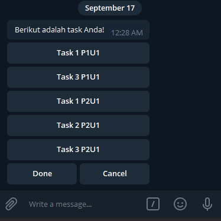
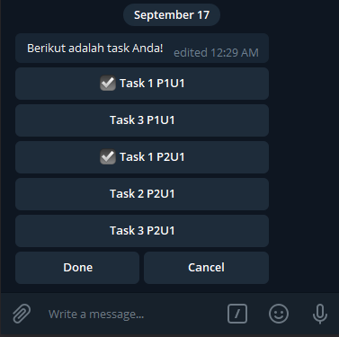

# Raccoonjs Example

Learn more about [raccoonjs](https://github.com/josestg/raccoonjs).

## Quick Start
```bash
$ git clone https://github.com/josestg/raccoonjs-example.git
$ cd raccoonjs-example
$ npm install
$ node main.js
```

command : **/r**

## Screenshoot




## Similar project
1. [privy-standup-meeting-bot](https://github.com/mtfiqh/privy-standup-meeting-bot.git)
